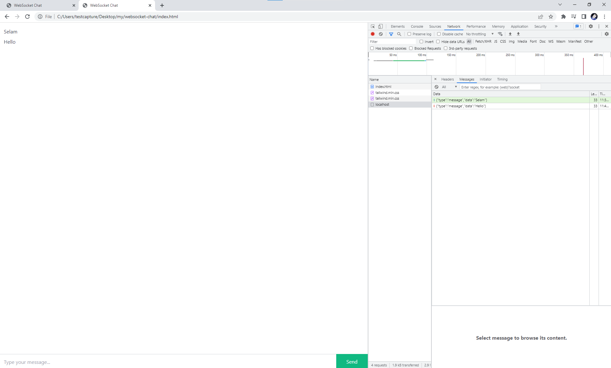

# Web Socket Server Chat Project 
## This project made by Muhammet Yayla with Html, Javascript, css and node.js

 You can download zip file for source code this project you have to do only these steps;
- After download zip file, open terminal in vscode and ``` locate project folder``` write this ``` node index.js``` (It runs server)
- After run server open index.html file in browser two times for checking is it realtime.
- ✨Now Test Chat App. Send message one of the client page and check is message come to the other page which is you open two clients page.
- All you need to do this. Enjoy it.
## Project Images

